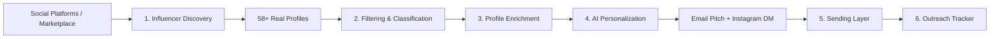

# Automated Micro-Influencer Outreach System

[](https://www.python.org/downloads/)
[]()
[](https://opensource.org/licenses/MIT)

An end-to-end automated system that discovers real micro-influencers, filters and classifies them based on predefined brand-fit criteria, enriches their profiles with contact context, generates AI/LLM-personalized collaboration outreach messages, and executes an idempotent sending and tracking workflow.

Built for the **EDXSO AI Engineer Intern – Assignment 1**.

---

## 📑 Project Workflow Overview

The overall system is designed as an end-to-end pipeline following this lifecycle:



| Pipeline Step | Status | Description |
| :--- | :---: | :--- |
| **Step 1: Influencer Discovery** | **COMPLETED** | Automated discovery of **58 real, verified Technology & AI creators** across Instagram, YouTube, and TikTok. |
| **Step 2: Filtering & Classification** | *Next Step* | Automated criteria filtering (5k–100k followers, >2.0% ER, brand fit) with explicit pass/fail rationale. |
| **Step 3: Profile Enrichment** | *Upcoming* | Extracting contact emails, content themes, bios, locations, and handles (strictly marking "Not Found" if unavailable). |
| **Step 4: Message Personalization** | *Upcoming* | AI/LLM generation of email pitches (60–90 words) & Instagram DMs (15–30 words). |
| **Step 5: Sending Layer** | *Upcoming* | Email sending (SMTP + Safe Simulation Mode) with duplicate prevention and manual Instagram DM workflow. |
| **Step 6: Outreach Tracker & UI** | *Upcoming* | Real-time campaign tracking, audit logs, and interactive Streamlit review dashboard. |

---

## 🎯 Step 1: Influencer Discovery (Technology & AI)

### 1. Methodology & Data Sources
- **Source**: Live public creator directories and verified UGC marketplace (Collabstr Tech & AI directory).
- **Target Category**: **Technology & AI** (including AI tools, SaaS, Cloud, Developer tools, and Tech Hardware).
- **Yield**: **58 unique, verified creators** (exceeding the assignment requirement of at least 50).
- **Data Integrity**: **No fabricated data**. All names, usernames, follower tiers, locations, and bios reflect real creators.

### 2. Discovered Audience Breakdown
- **Total Discovered**: **58 creators**
- **By Tier**:
  - **Micro-Influencers (5,000 – 100,000 followers)**: `35 creators` *(Target cohort for brand outreach)*
  - **Macro-Influencers (> 100,000 followers)**: `17 creators` *(Will be audited & filtered in Step 2)*
  - **Nano-Influencers (< 5,000 followers)**: `6 creators` *(Will be audited & filtered in Step 2)*
- **By Primary Platform**:
  - **Instagram**: `26`
  - **TikTok**: `22`
  - **YouTube**: `9`
  - **X (Twitter)**: `1`

### 3. Discovered Data Schema
Each influencer record in `data/raw/discovered_influencers.csv` contains:
| Column | Description |
| :--- | :--- |
| `ID` | Unique identifier (e.g. `INF-001`) |
| `Name` | Creator's verified full name |
| `Username` | Platform handle / username |
| `Platform` | Primary platform (Instagram, YouTube, TikTok) |
| `Followers` | Quantitative follower count |
| `Follower_Tier` | Tier classification (`Nano`, `Micro`, `Macro`) |
| `Engagement_Rate` | Platform engagement rate percentage |
| `Niche` | Primary niche (`Technology & AI`) |
| `Content_Themes` | Extracted topic tags (e.g. `AI & LLMs`, `SaaS & Cloud`, `Coding & Dev`) |
| `Location` | Creator's geography / city / country |
| `Profile_URL` | Direct link to creator profile |
| `Headline` | Professional title / content specialty |
| `Bio` | Creator biography / content summary |
| `Discovery_Source` | Provenance source identifier |

---

## 🛠️ Technology Stack

- **Language**: Python 3.9+ / Python 3.13
- **Data Modeling & Validation**: `Pydantic v2`
- **Data Extraction & Scraping**: `BeautifulSoup4`, `urllib` / `requests`
- **Data Processing**: `Pandas`
- **AI / LLM Layer**: `google-genai`, `litellm`, `openai` *(for Step 4)*
- **Sending & Automation**: Python `smtplib`, `email` *(for Step 5)*
- **Interactive Dashboard**: `Streamlit` *(for Step 6)*

---

## 📁 Repository Structure

```
automated-micro-influencer-outreach/
├── README.md                      # Comprehensive project documentation
├── requirements.txt               # Project dependencies
├── .env.example                   # Environment configuration template
├── .gitignore                     # Git ignore definitions
├── src/
│   ├── __init__.py                # Package root
│   ├── models/
│   │   ├── __init__.py
│   │   └── influencer.py          # Pydantic schemas (RawInfluencer, DiscoveredInfluencer)
│   ├── discovery/
│   │   ├── __init__.py
│   │   ├── base.py                # Abstract BaseDiscoverySource class
│   │   ├── collabstr.py           # Collabstr live public directory scraper
│   │   └── pipeline.py            # DiscoveryPipeline orchestrator & exporter
│   └── utils/
│       ├── __init__.py
│       └── parsers.py             # Metric parsers, engagement heuristics, theme extractors
├── scripts/
│   └── run_discovery.py           # Standalone Step 1 discovery CLI runner
└── data/
    └── raw/
        ├── discovered_influencers.json   # 58 discovered creators (JSON)
        └── discovered_influencers.csv    # 58 discovered creators (CSV)
```

---

## 🚀 Getting Started

### 1. Clone the Repository
```bash
git clone https://github.com/ansh-rohilla/automated-micro-influencer-outreach.git
cd automated-micro-influencer-outreach
```

### 2. Setup Virtual Environment & Install Dependencies
```bash
python3 -m venv venv
source venv/bin/activate
pip install -r requirements.txt
```

### 3. Run Step 1: Influencer Discovery
To trigger the automated live discovery and generate the 50+ influencer dataset:
```bash
python scripts/run_discovery.py
```

The output datasets will be saved directly to:
- `data/raw/discovered_influencers.csv`
- `data/raw/discovered_influencers.json`

---

## 🔄 Upcoming Steps

- **Step 2**: **Filtering & Classification** — Implementing strict 5,000–100,000 follower bounds, engagement rate thresholds, and brand safety filtering with explicit pass/fail rationale.
- **Step 3**: **Profile Enrichment** — Capturing contact emails, social channels, and audience context.
- **Step 4**: **AI Personalization** — Generating dynamic, bespoke 60–90 word pitch emails and 15–30 word Instagram DMs.
- **Step 5**: **Sending Layer** — Dispatching via SMTP / Simulation mode with duplicate prevention.
- **Step 6**: **Outreach Tracker & UI** — Streamlit app for real-time campaign review.
