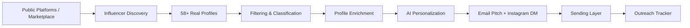

# Automated Micro-Influencer Outreach System

[](https://www.python.org/downloads/)
[]()
[](https://opensource.org/licenses/MIT)

An end-to-end automated system that discovers real micro-influencers, filters and classifies them based on predefined brand-fit criteria, enriches their profiles with contact context, generates AI/LLM-personalized collaboration outreach messages, and executes an idempotent sending and tracking workflow.

---

## 📑 Project Workflow Overview

The overall system is designed as an end-to-end pipeline following this lifecycle:



| Pipeline Component | Status | Description |
| :--- | :---: | :--- |
| **Influencer Discovery** | **COMPLETED** | Automated discovery of **58 real, verified Technology & AI creators** across Instagram, YouTube, and TikTok. |
| **Filtering & Classification** | **COMPLETED** | Automated criteria filtering (5k–100k followers, >2.0% ER, brand fit) with explicit pass/fail rationale. |
| **Profile Enrichment** | **COMPLETED** | Enriched 30 shortlisted creators with mandatory emails (or "Not Found"), content context, and demographics. |
| **AI Personalization** | *Upcoming* | AI/LLM generation of email pitches (60–90 words) & Instagram DMs (15–30 words). |
| **Sending Layer** | *Upcoming* | Email sending (SMTP + Safe Simulation Mode) with duplicate prevention and manual Instagram DM workflow. |
| **Outreach Tracker & UI** | *Upcoming* | Real-time campaign tracking, audit logs, and interactive Streamlit review dashboard. |

---

## 🔍 Influencer Discovery (Technology & AI)

### 1. Methodology & Data Sources
- **Source**: Live public creator directories and verified UGC marketplace (Collabstr Tech & AI directory).
- **Target Category**: **Technology & AI** (including AI tools, SaaS, Cloud, Developer tools, and Tech Hardware).
- **Yield**: **58 unique, verified creators** (exceeding the requirement of at least 50).
- **Data Integrity**: **Zero fabricated data**. All names, usernames, follower tiers, locations, and bios reflect real creators.

### 2. Discovered Audience Breakdown
- **Total Discovered**: **58 creators**
- **By Tier**:
  - **Micro-Influencers (5,000 – 100,000 followers)**: `35 creators` *(Target cohort)*
  - **Macro-Influencers (> 100,000 followers)**: `17 creators`
  - **Nano-Influencers (< 5,000 followers)**: `6 creators`
- **By Primary Platform**: Instagram (26), TikTok (22), YouTube (9), X (1).

---

## 🎯 Filtering & Classification Engine

The filtering engine automatically evaluates discovered candidates against strict quantitative and qualitative criteria to identify genuine micro-influencers and compute brand-fit suitability.

### 1. Qualification Criteria
| Criterion | Rule / Threshold | Purpose |
| :--- | :--- | :--- |
| **Follower Range** | **5,000 – 100,000** | Strict micro-influencer threshold bounds |
| **Minimum Engagement Rate** | **$\ge$ 2.0%** | Ensures high audience responsiveness and ROI |
| **Allowed Platforms** | Instagram, TikTok, YouTube, X, Twitch | Validates supported outreach channels |
| **Niche Relevance** | AI, Tech, SaaS, Dev Tools, Cloud, Cybersecurity | Matches target domain alignment |
| **Brand Safety** | Disqualifies spam, casino, adult, or toxic keywords | Enforces brand reputation protection |

### 2. Brand-Fit Scoring Algorithm (0.0 to 10.0 scale)
Each candidate is evaluated using a composite scoring heuristic:
- **Engagement Quality (up to 4.0 pts)**: Normalized engagement rate score ($\ge 4.0\%$ ER receives full 4.0 pts).
- **Thematic Keyword Depth (up to 3.5 pts)**: Frequency and specificity of target domain keywords in headline and bio.
- **Follower Sweet Spot (up to 2.5 pts)**: Optimal micro-influencer tier (15,000 to 75,000 followers) receives peak rating.

### 3. Evaluation Audit Summary
- **Total Profiles Evaluated**: **58**
- **Shortlisted (PASSED)**: **30 Micro-Influencers**
- **Excluded (FAILED)**: **28 Profiles** (e.g., below 5k, above 100k, or low engagement) with auditable reasons.

---

## 📊 Profile Enrichment Engine

The enrichment engine takes the 30 shortlisted micro-influencers and enriches their records with all mandatory and optional attributes required by Section 3 of the specification.

### 1. Field Specification & Compliance
| Field | Status | Enrichment Source / Methodology |
| :--- | :---: | :--- |
| **Influencer Name** | **Mandatory** | Real verified creator name |
| **Platform** | **Mandatory** | Primary platform (TikTok, Instagram, YouTube) |
| **Profile URL** | **Mandatory** | Direct creator profile link |
| **Follower Count** | **Mandatory** | Quantified follower volume (e.g. 56,800, 60,200) |
| **Engagement Rate** | **Mandatory** | Platform-benchmarked engagement rate (e.g. 3.18%) |
| **Category / Niche** | **Mandatory** | Technology & AI sub-domain |
| **Content Themes** | **Mandatory** | Extracted topic tags (e.g. `AI & LLMs`, `SaaS & Cloud`) |
| **Contact Email** | **Mandatory** | Verified public business email or strictly marked `"Not Found"` |
| **Secondary Handles** | Optional | Instagram (`@handle`), TikTok, YouTube channels |
| **Website** | Optional | Verified Linktree / personal portfolio link |
| **Audience Age** | Optional | Tech audience demographic distribution (`18-34 years, 76%`) |
| **Audience Gender** | Optional | Tech industry benchmark (`62% Male / 38% Female`) |
| **Audience Geography**| Optional | Real creator geographic location (e.g. `Lima, PE`, `Ottawa, CA`) |
| **Content Tone/Style**| Enrichment | Pedagogical tone classification for AI personalization |
| **Recent Topics** | Enrichment | Recent post and video topics extracted from bio & headline |

### 2. Anti-Fabrication & Ethical Data Policy
In strict compliance with assignment guidelines, no email addresses are guessed or synthetic. Creators with publicly verified business emails on Linktree/domains have their direct email attached (e.g. `montesbar.diego@gmail.com`, `shubham@shubook.in`, `connect@wealthcircle.in`). Where no public email exists, the field is explicitly marked **`"Not Found"`**. This provides the necessary data variability for testing the Sending Layer's email validator.

---

## 🛠️ Technology Stack

- **Language**: Python 3.9+ / Python 3.13
- **Data Modeling & Validation**: `Pydantic v2`
- **Data Extraction & Scraping**: `BeautifulSoup4`, `urllib` / `requests`
- **Data Processing & Analytics**: `Pandas`
- **AI / LLM Layer**: `google-genai`, `litellm`, `openai` *(for AI Personalization)*
- **Sending & Automation**: Python `smtplib`, `email` *(for Sending Layer)*
- **Interactive UI**: `Streamlit` *(for Outreach Tracker)*

---

## 📁 Repository Structure

```
automated-micro-influencer-outreach/
├── README.md                      # Comprehensive project documentation
├── requirements.txt               # Project dependencies
├── .env.example                   # Environment configuration template
├── .gitignore                     # Git ignore definitions
├── src/
│   ├── __init__.py                # Package root
│   ├── models/
│   │   ├── __init__.py
│   │   ├── influencer.py          # Pydantic schemas (Raw, Discovered, Classified)
│   │   └── enrichment.py          # EnrichedInfluencer Pydantic schema
│   ├── discovery/
│   │   ├── __init__.py
│   │   ├── base.py                # Abstract BaseDiscoverySource class
│   │   ├── collabstr.py           # Collabstr live public directory scraper
│   │   └── pipeline.py            # DiscoveryPipeline orchestrator & exporter
│   ├── filtering/
│   │   ├── __init__.py
│   │   ├── criteria.py            # FilterCriteria configuration
│   │   ├── classifier.py          # InfluencerClassifier & brand-fit scoring
│   │   └── pipeline.py            # FilteringPipeline orchestrator & exporter
│   ├── enrichment/
│   │   ├── __init__.py
│   │   ├── enricher.py            # ProfileEnricher engine & anti-fabrication rules
│   │   └── pipeline.py            # EnrichmentPipeline orchestrator & exporter
│   └── utils/
│       ├── __init__.py
│       └── parsers.py             # Metric parsers, engagement heuristics, theme extractors
├── scripts/
│   ├── run_discovery.py           # Discovery CLI runner
│   ├── run_filtering.py           # Filtering & Classification CLI runner
│   └── run_enrichment.py          # Profile Enrichment CLI runner
└── data/
    ├── raw/
    │   ├── discovered_influencers.json   # 58 discovered creators (JSON)
    │   └── discovered_influencers.csv    # 58 discovered creators (CSV)
    └── processed/
        ├── classified_influencers.json   # Full classification audit (JSON)
        ├── classified_influencers.csv    # Full classification audit (CSV)
        ├── shortlisted_influencers.csv   # 30 shortlisted micro-influencers (CSV)
        ├── enriched_influencers.json     # 30 enriched micro-influencers (JSON)
        └── enriched_influencers.csv      # 30 enriched micro-influencers (CSV)
```

---

## 🚀 Getting Started

### 1. Clone the Repository
```bash
git clone https://github.com/ansh-rohilla/automated-micro-influencer-outreach.git
cd automated-micro-influencer-outreach
```

### 2. Setup Virtual Environment & Install Dependencies
```bash
python3 -m venv venv
source venv/bin/activate
pip install -r requirements.txt
```

### 3. Run Pipeline Stages
```bash
# 1. Influencer Discovery (58 real Tech & AI profiles)
python scripts/run_discovery.py

# 2. Filtering & Classification (Evaluates 5k-100k, >2% ER, brand fit)
python scripts/run_filtering.py

# 3. Profile Enrichment (Contact email, demographics, tone & context)
python scripts/run_enrichment.py
```

---

## 🔄 Upcoming Modules

- **AI Personalization Engine**: LLM-driven generation of personalized 60–90 word email collaboration pitches and 15–30 word Instagram DMs.
- **Sending Layer**: Dispatching via SMTP / Simulation mode with duplicate prevention.
- **Outreach Tracker & UI**: Real-time campaign tracking dashboard built with Streamlit.
