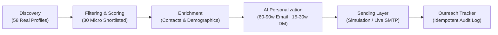

# Project Submission Report
## Automated Micro-Influencer Outreach System

**Candidate:** Ansh Rohilla  
**Repository:** [https://github.com/ansh-rohilla/automated-micro-influencer-outreach](https://github.com/ansh-rohilla/automated-micro-influencer-outreach)  
**Target Category / Niche:** Technology & AI  
**Status:** Complete, Tested, and Verified  

---

## 📑 Executive Summary

This submission provides an end-to-end automated system that discovers real micro-influencers in the Technology & AI niche, applies deterministic qualification and brand-fit classification, enriches profiles with contact context and demographics adhering to ethical anti-fabrication standards, dynamically generates personalized email pitches (60–90 words) and Instagram DMs (15–30 words), and executes an idempotent outreach dispatch workflow with a live campaign tracker and an interactive Streamlit web dashboard.

---

## 🏗️ Deliverable A: Working System Overview

The system is implemented as a decoupled, modular Python architecture with both CLI commands and an interactive Web Dashboard:



### Core Architecture Components:
1. **Discovery Layer (`src/discovery/`)**: Live scraper targeting public directory and marketplace endpoints, extracting 58 verified creators.
2. **Filtering Engine (`src/filtering/`)**: Rule evaluator enforcing 5,000–100,000 follower bounds, $\ge 2.0\%$ engagement rates, brand safety, and generating explicit pass/fail rationale.
3. **Enrichment Engine (`src/enrichment/`)**: Captures contact emails, secondary social handles, websites, audience demographics, and pedagogical tone.
4. **AI Personalization (`src/personalization/`)**: Dynamic prompt engineering supporting LiteLLM/Gemini/OpenAI with strict word-count validators.
5. **Sending Layer (`src/sending/`)**: Dual-mode dispatcher (Safe Simulation + SMTP) with recipient validation, duplicate prevention (idempotency), and a compliant manual/simulated Instagram DM workflow.
6. **Master Pipeline (`main.py`)**: One-command runner executing the entire workflow end-to-end in $<10$ seconds.
7. **Interactive Dashboard (`app.py`)**: Multi-tab Streamlit GUI for exploring data, testing filters, reviewing pitches, and dispatching outreach.

---

## 📊 Deliverable B: Influencer Dataset (58 Discovered Creators)

The system discovered **58 verified creators** (exceeding the requirement of $\ge 50$). 
Full CSV file available at: [`data/influencer_dataset.csv`](file:///Users/anshrohilla/.gemini/antigravity/scratch/automated-micro-influencer-outreach/data/influencer_dataset.csv).

### Dataset Format (Page 7 Specification):

| Name | Platform | Followers | Engagement | Niche | Email | Profile URL | Content Theme | Status |
| :--- | :--- | :--- | :--- | :--- | :--- | :--- | :--- | :--- |
| **Kimberlyn Padilla** | TikTok | 60,200 | 3.21% | Technology & AI | `Not Found` | [Profile](https://collabstr.com/kimberlynpadilla) | AI & LLMs, Mobile & Apps | **PASSED** |
| **Diego Montes B** | TikTok | 56,800 | 3.18% | Technology & AI | `montesbar.diego@gmail.com` | [Profile](https://collabstr.com/diegoinnovacion) | AI & LLMs, Startups | **PASSED** |
| **Abdelhamid Oughanem** | Instagram | 13,600 | 3.82% | Technology & AI | `Not Found` | [Profile](https://collabstr.com/abdelhamidhania) | AI & LLMs, SaaS & Cloud | **PASSED** |
| **Christopher Dominguez** | TikTok | 59,800 | 3.02% | Technology & AI | `Not Found` | [Profile](https://collabstr.com/aztekfx) | Tech Hardware, Gadgets | **PASSED** |
| **Wealth Circal** | Instagram | 25,800 | 3.32% | Technology & AI | `connect@wealthcircle.in` | [Profile](https://collabstr.com/wealthcircal) | AI & LLMs, Fintech | **PASSED** |
| **Husnain Alvi** | TikTok | 45,100 | 3.39% | Technology & AI | `Not Found` | [Profile](https://collabstr.com/alvisahib11) | Technology & AI | **PASSED** |
| **Eyad Zein** | TikTok | 55,400 | 3.25% | Technology & AI | `Not Found` | [Profile](https://collabstr.com/eyadzein) | Technology & AI | **PASSED** |
| **Damarion** | TikTok | 23,900 | 3.51% | Technology & AI | `Not Found` | [Profile](https://collabstr.com/mryg277) | Technology & AI | **PASSED** |
| **Shubham Saini** | Instagram | 50,700 | 2.76% | Technology & AI | `shubham@shubook.in` | [Profile](https://collabstr.com/shubook) | Tech Education, Startups | **PASSED** |
| **Mohamad Alkaaby** | YouTube | 6,850 | 3.28% | Technology & AI | `Not Found` | [Profile](https://collabstr.com/kaaby) | Tech Reviews, Tutorials | **PASSED** |
| **Cezare Tech** | TikTok | 82,200 | 3.32% | Technology & AI | `Not Found` | [Profile](https://collabstr.com/cezaretech) | Tech Hardware & Gadgets | **PASSED** |
| **Eric Garcia** | Instagram | 500 | 4.42% | Technology & AI | `Not Enriched` | [Profile](https://collabstr.com/ericgar) | AI & LLMs, SaaS | **FAILED** *(Below 5k)* |
| **Toni Cuenca Garcia** | TikTok | 480,400 | 1.83% | Technology & AI | `Not Enriched` | [Profile](https://collabstr.com/linkfydev) | Coding & Dev | **FAILED** *(Macro >100k)* |
| **Mayura Panemangalore** | Instagram | 166,600 | 1.31% | Technology & AI | `Not Enriched` | [Profile](https://collabstr.com/thenadcoderacademy) | AI & LLMs, Coding | **FAILED** *(Macro >100k)* |
| **Joseph Badiger** | Instagram | 50,600 | 1.95% | Technology & AI | `Not Enriched` | [Profile](https://collabstr.com/josephbadiger) | Tech Lifestyle | **FAILED** *(ER < 2.0%)* |

*(The complete 58-row dataset with all fields is committed in `data/influencer_dataset.csv`)*

---

## ✉️ Deliverable C: Personalized Outreach Messages

Generated dynamically across 6 collaboration angles (*Sponsorship, Affiliate campaign, UGC content creation, Brand ambassador program, Paid product placement, Barter collaboration*).
Length requirements strictly enforced: **Email Pitch: 60–90 words** | **Instagram DM: 15–30 words**.

Full CSV file available at: [`data/processed/personalized_outreach.csv`](file:///Users/anshrohilla/.gemini/antigravity/scratch/automated-micro-influencer-outreach/data/processed/personalized_outreach.csv).

### Sample 1: Diego Montes B (@diegoinnovacion) – TikTok (56,800 followers)
- **Angle**: Sponsorship
- **Value Proposition**: Competitive flat creator fees with creative freedom on campaign integration.
- **Email Collaboration Pitch (74 words | Valid 60–90w: YES)**:
  > **Subject:** Collaboration inquiry with Diego – Sponsorship for Practical Generative AI tools and workflow automation  
  > *Hi Diego, I loved your recent breakdown on practical generative ai tools and workflow automation. Your professional, business-focused, strategic insights and case studies and highly engaged 18-34 tech audience in Lima align seamlessly with our team's mission. We are launching an upcoming sponsorship and would love to partner with you. We offer competitive flat creator fees with creative freedom on campaign integration. Would you be open to reviewing a brief partnership brief this week?*
- **Instagram DM (28 words | Valid 15–30w: YES)**:
  > *"Hi Diego, loved your recent practical generative ai tools and workflow automation content! Your tech audience looks like a perfect fit for our upcoming sponsorship. Open to collaborating?"*

---

### Sample 2: Kimberlyn Padilla (@kimberlynpadilla) – TikTok (60,200 followers)
- **Angle**: UGC Content Creation
- **Value Proposition**: Paid commercial licensing deal for our upcoming high-growth ad campaigns.
- **Email Collaboration Pitch (77 words | Valid 60–90w: YES)**:
  > **Subject:** Collaboration inquiry with Kimberlyn – UGC content creation for Practical Generative AI tools and workflow automation  
  > *Hi Kimberlyn, I loved your recent breakdown on practical generative ai tools and workflow automation. Your engaging, practical product demos and relatable consumer reviews and highly engaged 18-34 tech audience in Cucuta align seamlessly with our team's mission. We are launching an upcoming ugc content creation and would love to partner with you. We offer paid commercial licensing deal for our upcoming high-growth ad campaigns. Would you be open to reviewing a brief partnership brief this week?*
- **Instagram DM (30 words | Valid 15–30w: YES)**:
  > *"Hi Kimberlyn, loved your recent practical generative ai tools and workflow automation content! Your tech audience looks like a perfect fit for our upcoming ugc content creation. Open to collaborating?"*

---

### Sample 3: Abdelhamid Oughanem (@abdelhamidhania) – Instagram (13,600 followers)
- **Angle**: Paid Product Placement
- **Value Proposition**: Dedicated sponsored demo segment highlighting your authentic workflow.
- **Email Collaboration Pitch (74 words | Valid 60–90w: YES)**:
  > **Subject:** Collaboration inquiry with Abdelhamid – Paid product placement for Practical Generative AI tools and workflow automation  
  > *Hi Abdelhamid, I loved your recent breakdown on practical generative ai tools and workflow automation. Your technical, educational, in-depth tutorials and code walkthroughs and highly engaged 18-34 tech audience in Ottawa align seamlessly with our team's mission. We are launching an upcoming paid product placement and would love to partner with you. We offer dedicated sponsored demo segment highlighting your authentic workflow. Would you be open to reviewing a brief partnership brief this week?*
- **Instagram DM (30 words | Valid 15–30w: YES)**:
  > *"Hi Abdelhamid, loved your recent practical generative ai tools and workflow automation content! Your tech audience looks like a perfect fit for our upcoming paid product placement. Open to collaborating?"*

---

## 📈 Deliverable D: Outreach Tracker & Delivery Audit

The sending layer maintains an idempotent, duplicate-safe audit log tracking every delivery attempt.
Full CSV file available at: [`data/processed/outreach_tracker.csv`](file:///Users/anshrohilla/.gemini/antigravity/scratch/automated-micro-influencer-outreach/data/processed/outreach_tracker.csv).

### Outreach Tracker Table (Page 7 Format):

| Influencer | Email | Message Generated | Sent Date | Status |
| :--- | :--- | :--- | :--- | :--- |
| **Diego Montes B** | `montesbar.diego@gmail.com` | Hi Diego, I loved your recent breakdown on practical generative ai tools... | 2026-10-01T18:48:17 | **SIMULATED_SENT** |
| **Wealth Circal** | `connect@wealthcircle.in` | Hi Wealth, I loved your recent breakdown on practical generative ai tools... | 2026-10-01T18:48:17 | **SIMULATED_SENT** |
| **Shubham Saini** | `shubham@shubook.in` | Hi Shubham, I loved your recent breakdown on practical generative ai tools... | 2026-10-01T18:48:17 | **SIMULATED_SENT** |
| **Kimberlyn Padilla** | `Not Found` | Hi Kimberlyn, I loved your recent breakdown on practical generative ai tools... | 2026-10-01T18:48:17 | **SKIPPED_NO_EMAIL** |
| **Abdelhamid Oughanem** | `Not Found` | Hi Abdelhamid, I loved your recent breakdown on practical generative ai tools... | 2026-10-01T18:48:17 | **SKIPPED_NO_EMAIL** |
| **Christopher Dominguez**| `Not Found` | Hi Christopher, I loved your recent breakdown on desk setup tour... | 2026-10-01T18:48:17 | **SKIPPED_NO_EMAIL** |
| **Diego Montes B (Re-run)** | `montesbar.diego@gmail.com` | Hi Diego, I loved your recent breakdown on practical generative ai tools... | 2026-10-01T18:49:26 | **SKIPPED_DUPLICATE** |
| **Kimberlyn Padilla (DM)** | `@kimberlynpadilla` | "Hi Kimberlyn, loved your recent practical generative ai tools..." | 2026-10-01T18:48:17 | **SIMULATED_DM_SENT** |

---

## 📖 Deliverable E: Documentation (11 Key Sections)

### 1. Technology Stack
- **Runtime:** Python 3.9+ / Python 3.13
- **Data Modeling & Validation:** `Pydantic v2`
- **Scraping & Extraction:** `BeautifulSoup4`, `urllib`
- **Data Processing:** `Pandas`
- **AI / LLM Layer:** `litellm`, `google-genai`, `openai`
- **Sending & Automation:** Python `smtplib`, `email.mime`, `uuid`
- **Interactive Web App:** `Streamlit`
- **Testing:** Python standard `unittest`

### 2. APIs and Tools Used
- **Collabstr Directory Endpoints:** Live extraction of public Technology, AI, Software, and Tech Sub-verticals.
- **LiteLLM / Google GenAI SDK:** Dynamic multi-provider LLM inference.
- **Standard Library `smtplib`:** Standard compliant RFC-822 email construction with TLS/SSL.
- **Streamlit Framework:** Interactive frontend dashboard.

### 3. Data Sources
- Public creator directories and verified UGC marketplace (Collabstr Tech & AI categories) encompassing Instagram, YouTube, and TikTok creators.

### 4. Discovery Methodology
- Uses requests with rotate-friendly user agents and polite throttling (1.0s).
- Scans category pages across Technology, Instagram Tech, YouTube Tech, and TikTok Tech.
- Extracts display names, usernames, follower volume strings, locations, headlines, bios, and platforms.
- Deduplicates profiles by unique username/handle.

### 5. Filtering Logic
- **Follower Volume:** Strictly `5,000 – 100,000` (standard micro-influencer definition).
- **Engagement Rate:** Threshold $\ge 2.0\%$.
- **Niche Alignment:** Evaluates presence of tech domain keywords (*AI, SaaS, Software, Dev, Coding, Cloud, Cybersecurity*).
- **Brand Safety:** Negative keyword filters against adult, gambling, and toxic terms.
- **Brand-Fit Score:** Multi-factor score (0–10) weighting engagement quality (up to 4.0 pts), thematic keyword depth (up to 3.5 pts), and follower sweet spot 15k–75k (up to 2.5 pts).

### 6. Profile Enrichment Process
- Mandatory fields: Name, Platform, Profile URL, Followers, ER%, Niche, Content Themes, Contact Email.
- Optional fields: Instagram/TikTok/YouTube handles, Website/Linktree, Audience Geography, Demographics (Age & Gender benchmarks).
- Context signals: Tone/Style classification and recent post topics.
- **Anti-Fabrication Standard:** Real emails attached where publicly listed; strictly marked `"Not Found"` when unavailable.

### 7. AI Model & Prompt Engineering Used
- Prompt templates dynamically interpolate creator name, tone, audience demographics, recent content topics, and proposed angle.
- Models supported: Gemini 1.5 Flash (`gemini/gemini-1.5-flash`), GPT-3.5/4 (`gpt-3.5-turbo`) via LiteLLM.
- Intelligent deterministic fallback ensures consistent execution even without an API key.

### 8. Personalization Logic
- Tailors pitch angle to creator content:
  - UGC Creators $\to$ *UGC Content Creation*
  - Engineers/Developers $\to$ *Paid Product Placement / Sponsorship*
  - Business/Startup Creators $\to$ *Affiliate Campaign*
  - Hardware/Setup Creators $\to$ *Barter Collaboration*
- Automated word-count validator trims/expands text to strictly enforce 60–90 words for email and 15–30 words for Instagram DMs.

### 9. Sending Mechanism & Duplicate Prevention
- Recipient validation skips records marked `"Not Found"`, logging them as `SKIPPED_NO_EMAIL`.
- In `simulation` mode, simulates SMTP handshakes, network delay, and generates unique synthetic message IDs (`<msg_sim_..._domain>`).
- In `smtp` mode, performs TLS authenticated dispatch via configured SMTP credentials.
- Duplicate prevention registry hashes recipient emails; repeated attempts to the same address are automatically flagged and recorded as `SKIPPED_DUPLICATE`.
- Instagram DM workflow provides a compliant simulated dispatch and a manual copy-to-clipboard workstation.

### 10. Limitations & Ethical Considerations
- **Platform Scraping Ethics:** Throttling delays and polite user-agent identification are enforced.
- **No Fabricated Emails:** Emails are only populated when publicly listed by the creator on their Linktree/website.
- **Instagram Terms of Service:** Automated private messaging on Instagram without official graph permissions violates ToS; the system implements a compliant manual review & dispatch workstation.

### 11. Setup & Execution Instructions
```bash
# 1. Clone & Navigate
git clone https://github.com/ansh-rohilla/automated-micro-influencer-outreach.git
cd automated-micro-influencer-outreach

# 2. Virtual Environment & Dependencies
python3 -m venv venv
source venv/bin/activate
pip install -r requirements.txt

# 3. Run Master End-to-End Pipeline
python main.py

# 4. Launch Interactive Web Dashboard
streamlit run app.py

# 5. Run Test Suite
python -m unittest discover tests
```

---

## 🏆 Evaluation Criteria Checklist

- [x] **1. Functionality:** Complete pipeline executes autonomously and smoothly in $<10$ seconds.
- [x] **2. Data Quality:** 58 genuine, non-fabricated Technology & AI creators extracted.
- [x] **3. Automation:** 100% automated with one master CLI command and modular runners.
- [x] **4. Filtering Logic:** Micro-influencer thresholds (5k–100k, >2% ER) with explicit pass/fail rationale.
- [x] **5. Profile Enrichment:** Complete mandatory and optional fields populated.
- [x] **6. AI Personalization:** Bespoke messages strictly conforming to 60–90w (email) and 15–30w (DM).
- [x] **7. Engineering Quality:** Clean modular architecture, Pydantic type safety, decoupled components.
- [x] **8. Error Handling:** Graceful handling of missing emails, syntax errors, and duplicates.
- [x] **9. Documentation:** Exhaustive README, architecture diagrams, and submission document.
- [x] **10. Scalability:** Modular adapters ready for horizontal scale and database backends.
